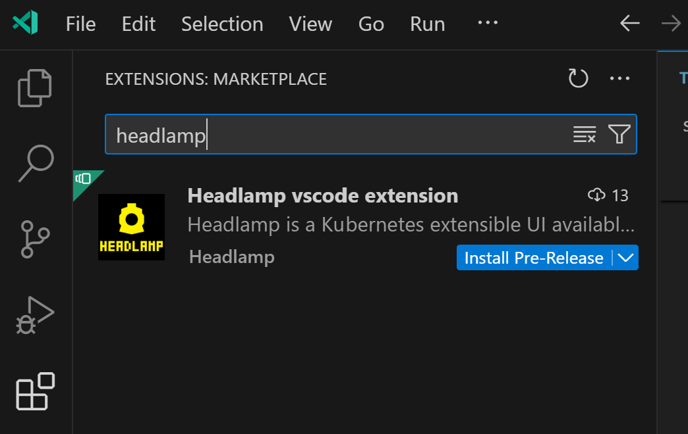
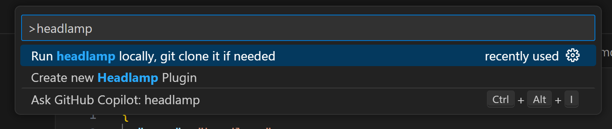

# Headlamp vscode extension

Headlamp is a Kubernetes extensible UI available on Desktop and in cluster. This extension helps with using Headlamp and with development of plugins for Headlamp.

This is a preview release.

## Install the Headlamp extension

## Features

Access these commands from the command pallet in vscode.

Use ctrl+p (cmd+p on mac) to bring up the command pallet, and enter "headlamp" to see the Headlamp related commands.

### Command: Create new Headlamp Plugin

There is a command to create a new headlamp plugin.

### Command: Run headlamp locally, git clone it if needed

There is a command to run Headlamp in development mode.

It opens up a terminal for the backend server, and a terminal for the frontend server in dev mode.

Additionally, if you have not git cloned the headlamp repo it asks you before cloning it.

## Requirements

Please see the [Headlamp Development Guide](https://headlamp.dev/docs/latest/development/) for dependencies and instructions on how to get set up.

## Known Issues

https://github.com/headlamp-k8s/vscode-extension-headlamp/issues

## Release Notes

Users appreciate release notes as you update your extension.

### 0.1.3

Small bug fix release with improvements to creating a plugin command and cloning headlamp command.

### 0.1.2

Small bug fixes.

### 0.1.1

Small bug fixes.

### 0.1.0

Initial release of Headlamp vscode extension.
